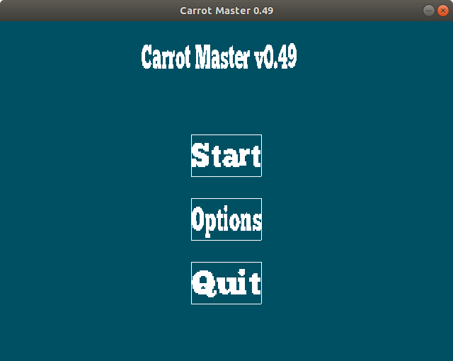
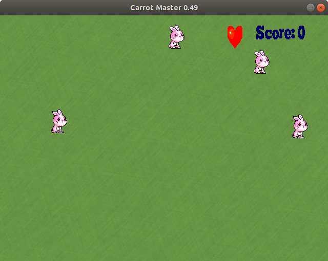
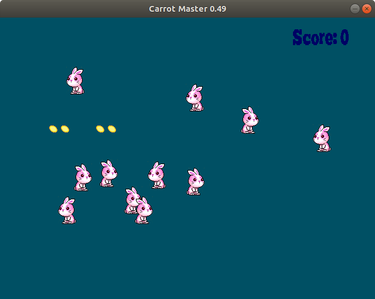
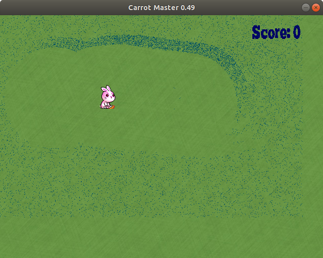

p# carrot_master

<b>2D top-down shooter (C++ and SDL2)</b>

Simple DirectMedia Layer: https://www.libsdl.org/
Assets: https://opengameart.org/

**Disclaimer**: This is a demo. There are currently 3 levels and 2 of them are playable, although they are quite short.

**Screenshots**

**Known issues**: 

The return button in the 'Options' menu doesn't work. You can use the 'Esc' key to go back.

**Instructions**:

Use the w, a, s, d keys or the arrow keys to move and the spacebar to shoot.

**Walkthrough**:

Level 1: eliminate the other bunnies and pick up the heart before they respawn.

Level 2: eliminate all the bunnies. 

Level 3: -
